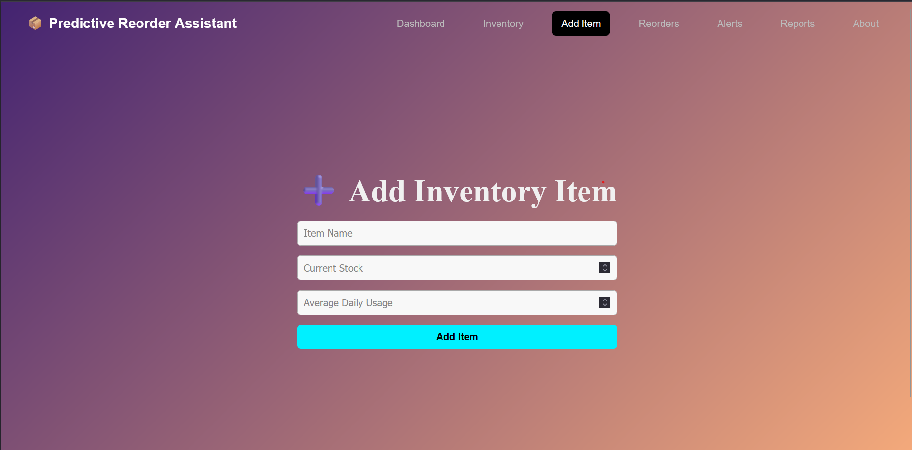
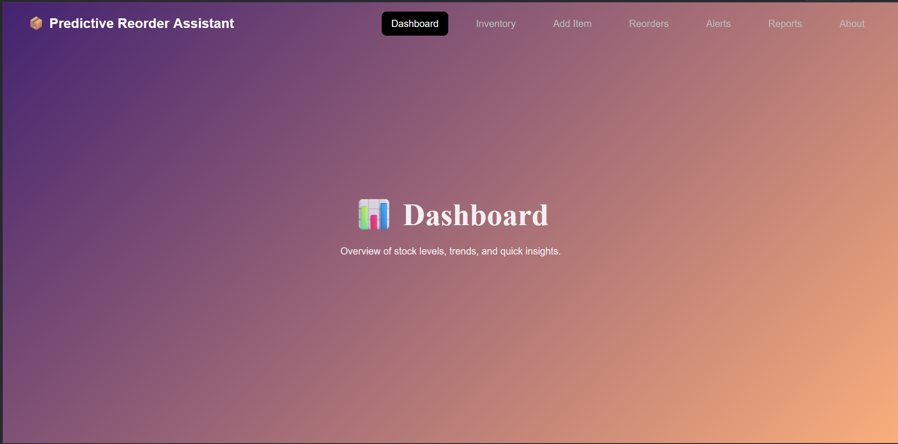
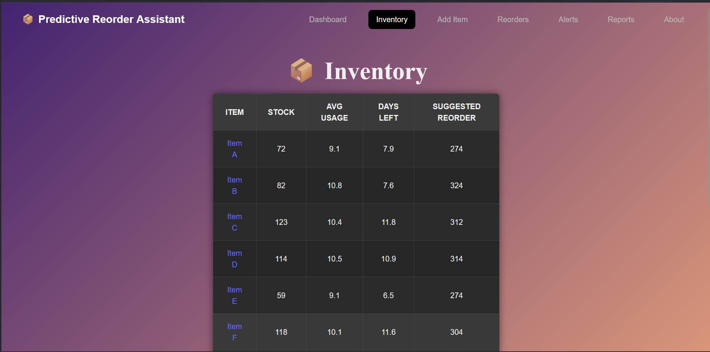
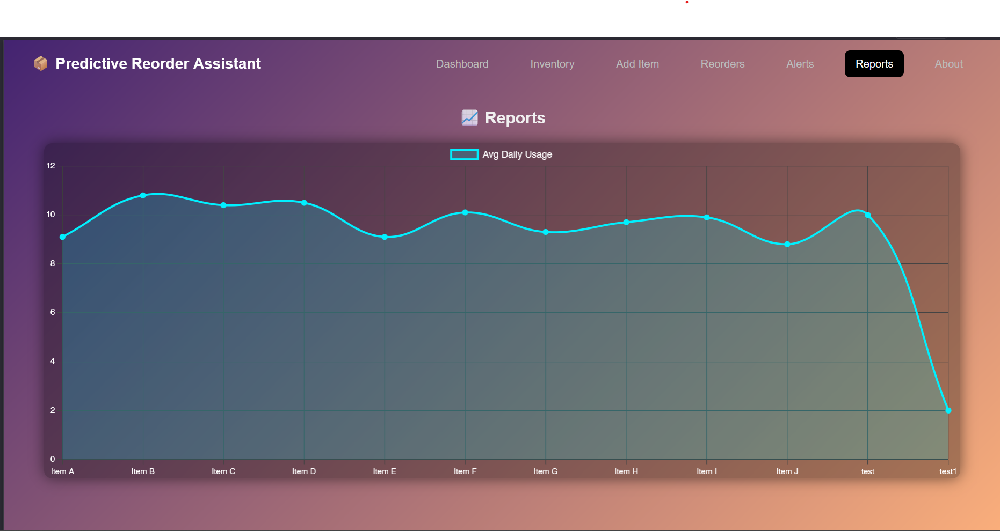

# 📦 Predictive Reorder Assistant

A smart inventory management system that forecasts stock run-out dates and suggests reorder quantities using historical usage data. Built with **React**, **Node.js**, and **MongoDB**, this app helps you stay ahead of your stock needs with visual insights and predictive logic.

---

## 🚀 Project Overview

This project was built as part of an assignment to demonstrate practical use of the MERN stack in solving real-world problems. The goal was to design an MVP for a **Predictive Reorder Assistant** that:

- Forecasts when items in stock will run out based on usage history
- Suggests reorder quantities using average daily consumption
- Visualizes trends through a clear and simple dashboard

---

## 💡 Key Features

| Feature | Description |
|--------|-------------|
| 📋 Inventory Table | Lists all items with stock, usage, and reorder suggestions |
| 🔍 Inventory Details | Click any item to view detailed metrics |
| ➕ Add New Item | Form to add inventory with starting stock and usage |
| ⚠️ Reorder Alerts | Highlights items running low or about to run out |
| 📈 Reports | Graphs showing stock movement and trends |
| 🧠 Intelligent Suggestions | Calculates average daily usage and suggests monthly reorder quantity |

---

## 🛠️ Tech Stack

### 🧩 Frontend
- **React.js**: UI rendering and component-based architecture
- **Axios**: API calls to the backend
- **Vite**: Frontend development build tool for fast refresh and optimized builds

### ⚙️ Backend
- **Node.js**: JavaScript runtime environment
- **Express.js**: Lightweight backend framework for building REST APIs
- **Mongoose**: ODM (Object Data Modeling) library for MongoDB

### 🛢 Database
- **MongoDB**: NoSQL database used for storing inventory and reorder data

### 🌐 API
- **RESTful API**: Inventory and prediction logic exposed via REST endpoints

### 🔧 Tools & Dev Utilities
- **VS Code**: UI rendering and component-based architecture
- **Git & GitHub**: API calls to the backend
- **Postman**: Frontend development build tool for fast refresh and optimized builds
- **Portable MongoDB**: Local MongoDB instance without installation

### 📦 NPM Packages
- `dotenv`
- `cors`
- `nodemon`
- `axios`
- `mongoose`
- `express`

### 🧑‍💻 Programming Languages Used
- **JavaScript**: Used across both frontend (React.js) and backend (Node.js + Express)
- **JSON**: For API data exchange between frontend and backend

---

## 🧑‍💻 Setup Instructions

### ⚙️ Prerequisites
- Node.js (v16+)
- MongoDB (local or cloud)
- npm / yarn

---

### 📦 Backend Setup (Node + Express)

```bash
cd server
npm install
```

### 📝 Create a .env file in the server/ directory:
MONGO_URI=mongodb://localhost:27017/inventorydb

PORT=5000

```bash
npm start
```

### 🌐 Frontend Setup (React)

```bash
cd client
npm install
npm run dev
```

---

## Screenshots






---

## 🧠 Approach & Thought Process

The goal was to keep the experience lightweight yet insightful. I structured the solution around:
- Clean RESTful routes for data flow
- React Router for deep linking (/inventory/:id)
- Smart calculations on the backend to keep frontend logic minimal
- Minimal design using plain CSS, dark theme, and responsive layout
- Modular file structure to allow easy scaling (e.g., auth, user roles).

The hardest part was ensuring the trend forecasting logic was clear and usable. I chose to use a 30-day reorder prediction to keep it practical.

---

## 🔮 Potential Improvements

- Edit / Delete inventory items
- Authentication for restricted access
- Advanced analytics with filters
- Notification system for low-stock items
- Export reports as PDF/CSV

---

## 📬 Contact
Feel free to reach out if you’d like to discuss improvements or feedback!
- **Name**: Aditya Chitransh
- **Email**: adityachitransh18@gmail.com
- **LinkedIn**: [Linkedin](https://www.linkedin.com/in/aditya-chitransh-213583275/)

---

## 🏁 Conclusion

This project was a great exercise in applying full-stack skills to solve a real business problem. It focuses on clarity, functionality, and clean design — ready for real-world adaptation.
Thanks for reviewing!
